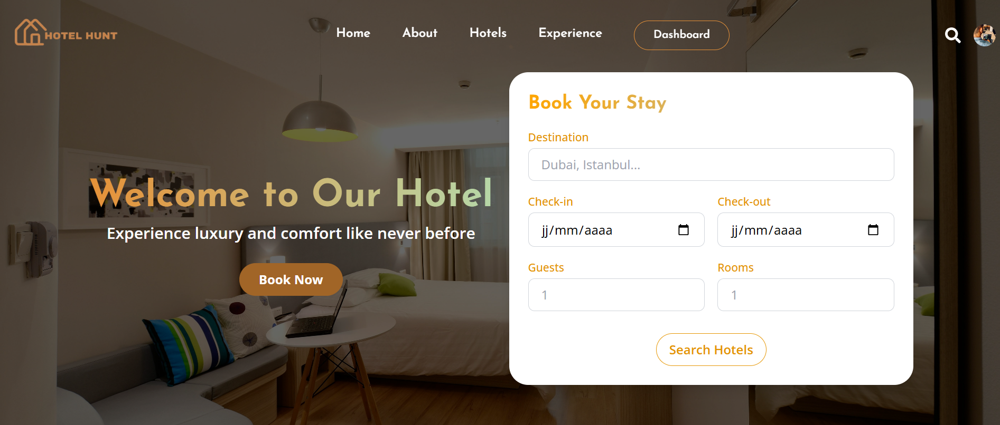

# 🏨 Hotel Hunt

**Hotel Hunt** is a hotel browsing and booking website built with **React** and **Tailwind CSS**.  
The goal of this project is to provide a modern, responsive, and user-friendly interface for exploring hotels and their details.
This is **my first project using React**, where I applied what I have learned in modern web development, including component-based architecture, responsive design, and deployment with Netlify.


---



---

## 🚀 Live Demo
🔗 [View Website](https://hotelhunt.netlify.app/)

---

## ✨ Features
- Fully responsive design for all devices.
- Modern UI styled with **Tailwind CSS**.
- Hotel cards with images, rating, and location.
- Clean and organized homepage sections.
- Deployed with **Netlify**.

---

## 🛠️ Tech Stack
- [React](https://react.dev/) ⚛️
- [Vite](https://vitejs.dev/) ⚡
- [Tailwind CSS](https://tailwindcss.com/) 🎨
- [Netlify](https://www.netlify.com/) ☁️

---


## ⚡ Installation & Setup
Run the project locally:

```bash
# Clone the repository
git clone https://github.com/Naadix/Hotel-Website.git

# Navigate into the project folder
cd clientbooking

# Install dependencies
npm install

# Start the development server
npm run dev
